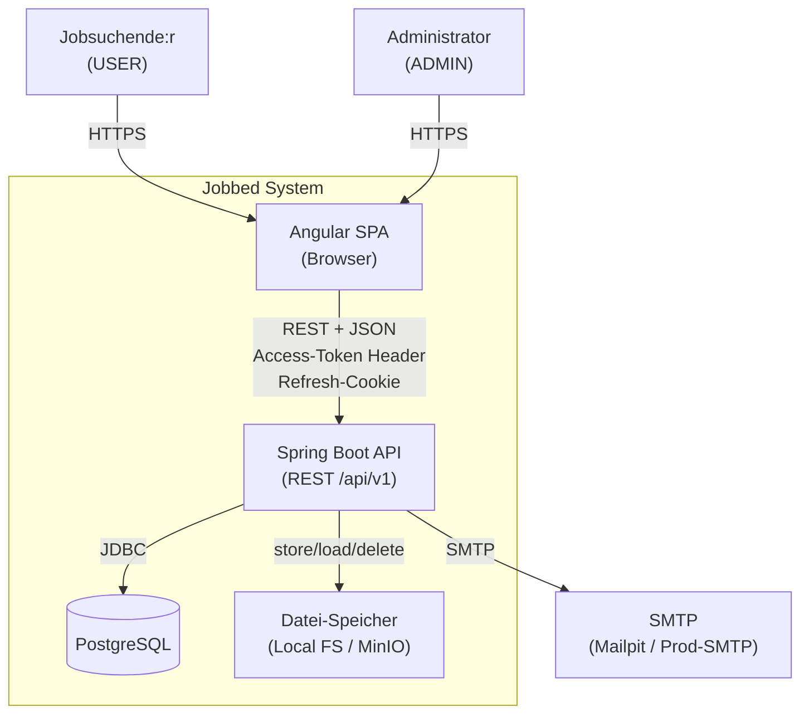
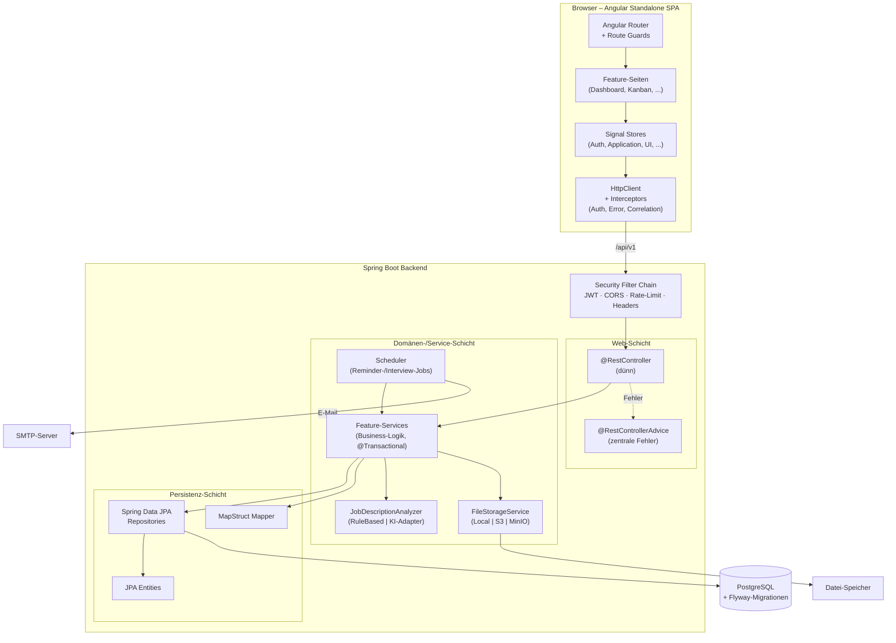
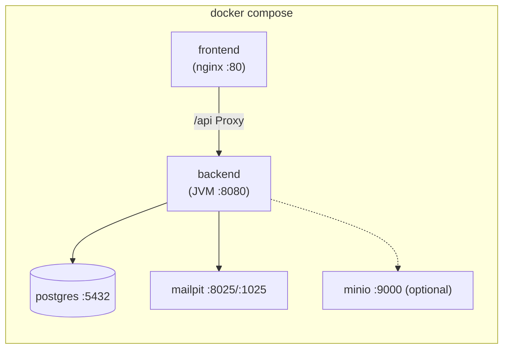

# Jobbed – Systemarchitektur

> Status: Phase 1 (Planung) · Letzte Aktualisierung: 2026-07-18

## 1. Überblick

Jobbed ist ein Bewerbungs-Tracker für Jobsuchende. Die Anwendung besteht aus
einem **Angular-SPA-Frontend**, einem **Spring-Boot-REST-Backend** und einer
**PostgreSQL-Datenbank**. Ergänzt wird das System durch einen SMTP-Server für
E-Mail-Benachrichtigungen (lokal Mailpit) und einen optionalen Objektspeicher
(lokal MinIO) für Datei-Uploads.

Leitprinzipien:

- **Trennung von Zuständigkeiten** – dünne Controller, Fachlogik in Services,
  Persistenz in Repositories, API-Verträge über DTOs.
- **Sicherheit als Default** – strikte Mandantentrennung, Autorisierung immer
  serverseitig, Refresh-Tokens in HTTP-only-Cookies.
- **Austauschbarkeit** – Datei-Speicher und Stellenanzeigen-Analyse hinter
  Interfaces, damit lokale Implementierungen später gegen Cloud-/KI-Adapter
  getauscht werden können.
- **Betreibbarkeit** – vollständig via `docker compose up --build` startbar,
  Health-/Readiness-/Liveness-Endpunkte, strukturierte Logs mit Correlation-ID.

## 2. Systemkontext (C4 – Level 1)



## 3. Container- und Komponentenarchitektur (C4 – Level 2/3)



## 4. Backend-Modulschnitt

Package-Wurzel `com.jobbed`. Jedes Feature-Modul ist vertikal geschnitten und
enthält `controller`, `service`, `repository`, `entity`, `dto`, `mapper`,
`validation`, `exception` sowie Tests.

| Modul          | Verantwortung                                                        |
|----------------|----------------------------------------------------------------------|
| `auth`         | Registrierung, Login, JWT, Refresh-Token-Rotation, E-Mail-Verifikation, Passwort-Reset |
| `user`         | User, UserProfile, Admin-Nutzerverwaltung                            |
| `company`      | Unternehmen                                                          |
| `contact`      | Ansprechpartner                                                      |
| `application`  | Bewerbungen, Status, Aktivitäten, Tags                              |
| `interview`    | Interviews / Termine                                                 |
| `document`     | Datei-Upload/-Download, Speicher-Abstraktion                        |
| `reminder`     | Erinnerungen                                                         |
| `analytics`    | Kennzahlen und Auswertungen (read-optimiert)                        |
| `notification` | In-App- und E-Mail-Benachrichtigungen, Scheduler                    |
| `jobanalysis`  | Regelbasierte Stellenanzeigen-Analyse (+ optionaler KI-Adapter)     |
| `ai`           | Server-only KI-Gateway, Status und Provider-Konfiguration           |
| `resume`       | Strukturierter Lebenslauf-Generator mit KI-/Vorlagenmodus           |
| `common`       | Fehlerformat, Paging, Basis-DTOs, Utilities                          |
| `config`       | Spring-Konfiguration (CORS, OpenAPI, Async, Scheduling, Jackson)    |
| `security`     | Filter, JWT-Provider, UserDetails, Method-Security, Rate-Limiting   |

**Schichtenregeln:** Controller → Service → Repository. Entities verlassen nie
die Web-Schicht; MapStruct übersetzt Entity ↔ DTO. Cross-Modul-Zugriffe laufen
über Service-Schnittstellen, nicht über fremde Repositories.

## 5. Frontend-Architektur

- **Standalone Components** ohne NgModules; Lazy-Loading pro Feature-Route.
- **State:** Angular Signals als primärer Mechanismus. Signal-basierte Stores
  (`AuthStore`, `ApplicationStore`, `CompanyStore`, `NotificationStore`,
  `UiStore`). Serverdaten strikt getrennt von UI-State.
- **HTTP:** funktionale Interceptors für (1) Access-Token-Anhang, (2) zentrales
  Error-Mapping, (3) Correlation-ID, (4) automatisches, single-flight
  Token-Refresh bei 401.
- **Guards:** `authGuard`, `roleGuard(ADMIN)`, `unsavedChangesGuard`.
- **Struktur:**

```text
frontend/src/app/
├── core/         # Interceptors, Guards, HTTP-Services, Modelle
├── shared/       # UI-Komponenten, Pipes, Direktiven, Material-Theme
├── features/     # auth, dashboard, applications, kanban, companies,
│                 # contacts, interviews, reminders, documents,
│                 # analytics, job-analysis, profile, settings, admin
├── layout/       # Sidebar, Topbar, Breadcrumbs, Shell
└── app.config.ts # Provider (Router, HttpClient+Interceptors, Material)
```

## 6. Querschnittsthemen

| Thema             | Umsetzung                                                             |
|-------------------|----------------------------------------------------------------------|
| Fehlerbehandlung  | Backend: einheitliches JSON-Fehlerformat via `@RestControllerAdvice`. Frontend: Error-Interceptor mappt auf Toasts/Feldfehler. |
| Logging           | Strukturierte Logs (JSON in `prod`), Correlation-ID pro Request via MDC, keine Secrets/Tokens im Log. |
| Konfiguration     | Spring-Profile `dev`/`test`/`prod`, `.env` + `application-*.yml`, Angular-Environments. |
| API-Doku          | springdoc-openapi, Swagger UI unter `/swagger-ui.html`.              |
| Monitoring        | Actuator `health`/`info`/`metrics`, optional Micrometer→Prometheus.  |
| Migrationen       | Flyway; `ddl-auto=validate` in `prod`.                               |

## 7. Deployment-Topologie (lokal)



- **Multi-Stage-Builds:** Frontend (Node-Build → nginx), Backend (Maven-Build →
  schlankes JRE-Image).
- **Healthchecks** je Container; `depends_on` mit `condition: service_healthy`.
- **Volumes** für Postgres-Daten und (bei lokalem FS) Upload-Verzeichnis.

## 8. Architekturentscheidungen (ADR-Kurzform)

1. **Angular Signals statt NgRx** – geringere Boilerplate, ausreichend für den
   Umfang; Server-State getrennt gehalten. Trade-off: keine Time-Travel-Devtools.
2. **Refresh-Token im HTTP-only-Cookie, Access-Token im Speicher** – schützt vor
   XSS-Token-Diebstahl. Trade-off: CSRF-Schutz für Cookie-Endpunkte nötig
   (SameSite=Strict + dedizierter Refresh-Pfad).
3. **Vertikaler Modulschnitt im Backend** – hohe Kohäsion pro Feature statt
   technischer Layer-Packages. Trade-off: etwas mehr Wiederholung.
4. **Interfaces für Storage & Analyzer** – lokale Default-Implementierung,
   Cloud/KI später ohne API-Bruch ergänzbar.
5. **Monorepo** – ein Repository, unabhängig baubares `frontend`/`backend`.

## 9. Verweise

- Datenmodell: [data-model.md](data-model.md)
- API-Entwurf: [api-design.md](api-design.md)
- Sicherheitskonzept: [security.md](security.md)
- Umsetzungsplan: [implementation-plan.md](implementation-plan.md)
- Risiken: [risks.md](risks.md)
