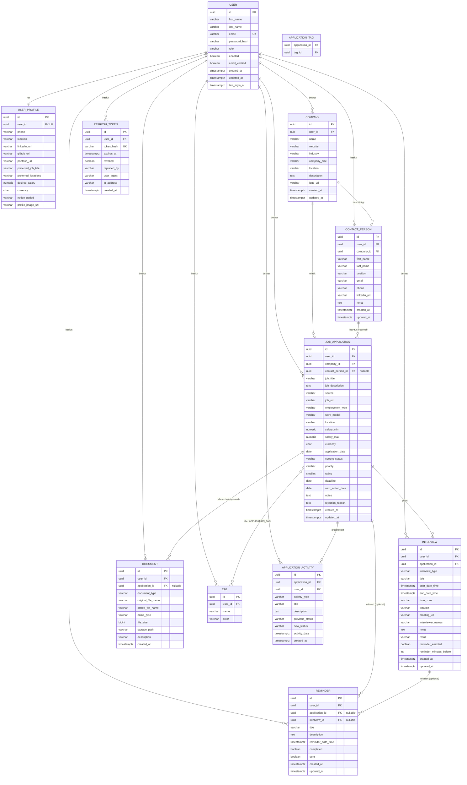
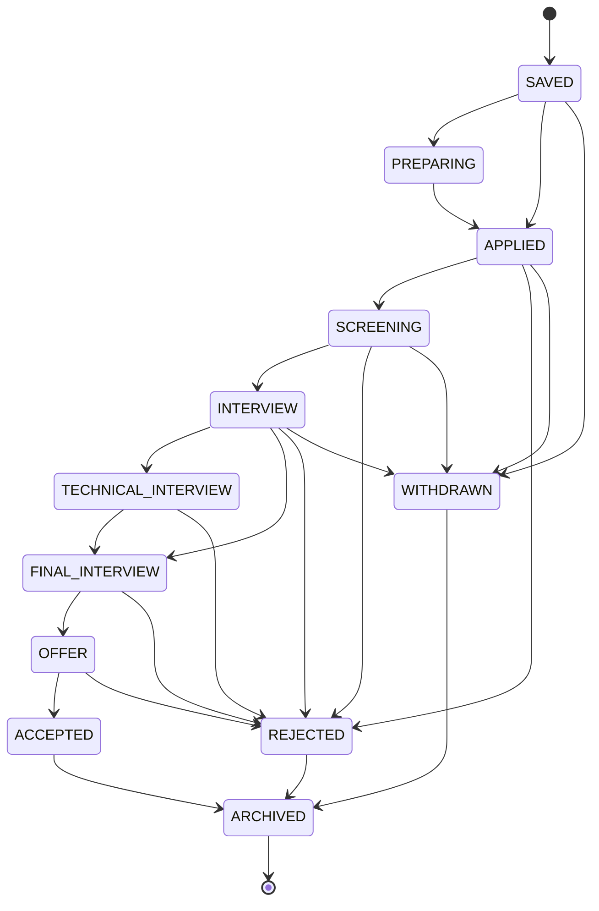

# Jobbed – Datenmodell

> Status: Phase 1 (Planung) · Letzte Aktualisierung: 2026-07-18

## 1. Grundsätze

- **Mandantentrennung auf Zeilenebene:** Nahezu jede fachliche Tabelle trägt
  `user_id` als Fremdschlüssel. Autorisierung erfolgt serverseitig durch
  Abgleich mit dem Security-Context – die `userId` kommt **nie** aus dem Request.
- **UUID-Primärschlüssel** (`uuid`, serverseitig generiert) statt fortlaufender
  IDs, um Enumeration/IDOR-Angriffe zu erschweren.
- **Zeitstempel** `created_at` / `updated_at` als `timestamptz` (UTC).
- **Enums als `varchar` + CHECK/Applikations-Validierung** (keine Postgres-Enum-
  Typen, um Flyway-Migrationen einfach zu halten).
- **Soft-Delete** wird bewusst **nicht** global eingeführt; Bewerbungen nutzen
  stattdessen den Status `ARCHIVED`.
- **Geldbeträge** als `numeric(12,2)` + separates `currency` (ISO-4217, `char(3)`).

## 2. ER-Diagramm

## 3. Enum-Wertebereiche

| Enum                 | Werte |
|----------------------|-------|
| `role`               | `USER`, `ADMIN` |
| `current_status`     | `SAVED`, `PREPARING`, `APPLIED`, `SCREENING`, `INTERVIEW`, `TECHNICAL_INTERVIEW`, `FINAL_INTERVIEW`, `OFFER`, `ACCEPTED`, `REJECTED`, `WITHDRAWN`, `ARCHIVED` |
| `priority`           | `LOW`, `MEDIUM`, `HIGH`, `URGENT` |
| `employment_type`    | `FULL_TIME`, `PART_TIME`, `CONTRACT`, `INTERNSHIP`, `WORKING_STUDENT`, `FREELANCE` |
| `work_model`         | `ONSITE`, `HYBRID`, `REMOTE` |
| `activity_type`      | `CREATED`, `STATUS_CHANGED`, `NOTE_ADDED`, `EMAIL_SENT`, `INTERVIEW_SCHEDULED`, `FOLLOW_UP`, `DOCUMENT_UPLOADED`, `OFFER_RECEIVED`, `REJECTED`, `CUSTOM` |
| `interview_type`     | `PHONE`, `VIDEO`, `ONSITE`, `TECHNICAL`, `HR`, `CULTURAL_FIT`, `FINAL`, `OTHER` |
| `interview.result`   | `PENDING`, `PASSED`, `FAILED`, `CANCELLED`, `NO_SHOW` |
| `document_type`      | `CV`, `COVER_LETTER`, `CERTIFICATE`, `REFERENCE`, `PORTFOLIO`, `JOB_DESCRIPTION`, `OTHER` |

Der `rating`-Wert ist eine Ganzzahl 1–5 (CHECK-Constraint). `current_status`
wird im Frontend über eine konfigurierbare Metadaten-Tabelle (Label, Farbe,
Reihenfolge, Kanban-Spalte) dargestellt.

## 4. Bewerbungsstatus-Workflow

Übergänge werden im Frontend als erlaubte Ziele geführt; das Backend erlaubt aus
Pragmatismus jeden Statuswechsel, protokolliert ihn aber als
`APPLICATION_ACTIVITY` (`STATUS_CHANGED` mit `previous_status`/`new_status`).
Wechsel nach `REJECTED`/`WITHDRAWN` erfordern im Frontend einen Bestätigungsdialog.

## 5. Beziehungen und referentielle Integrität

| Beziehung                              | Kardinalität | ON DELETE |
|----------------------------------------|--------------|-----------|
| USER → USER_PROFILE                    | 1 : 1        | CASCADE   |
| USER → COMPANY / CONTACT / APPLICATION | 1 : n        | CASCADE   |
| COMPANY → JOB_APPLICATION              | 1 : n        | RESTRICT (Firma mit Bewerbungen nicht löschbar) |
| COMPANY → CONTACT_PERSON               | 1 : n        | CASCADE   |
| CONTACT_PERSON → JOB_APPLICATION       | 0..1 : n     | SET NULL  |
| JOB_APPLICATION → APPLICATION_ACTIVITY | 1 : n        | CASCADE   |
| JOB_APPLICATION → INTERVIEW            | 1 : n        | CASCADE   |
| JOB_APPLICATION ↔ TAG                  | n : m        | CASCADE (Join) |
| APPLICATION/INTERVIEW → REMINDER       | 0..1 : n     | CASCADE   |
| USER → REFRESH_TOKEN                   | 1 : n        | CASCADE   |

## 6. Indizes

Neben den automatischen PK-/UK-Indizes:

| Tabelle              | Index                                                   | Zweck |
|----------------------|---------------------------------------------------------|-------|
| `user`               | `UNIQUE(lower(email))`                                   | Login, Eindeutigkeit case-insensitiv |
| `job_application`    | `(user_id, current_status)`                             | Kanban/Filter |
| `job_application`    | `(user_id, company_id)`                                 | Filter nach Firma |
| `job_application`    | `(user_id, application_date DESC)`                      | Sortierung/Zeitreihen |
| `job_application`    | `(user_id, next_action_date)`                           | Follow-ups/Dashboard |
| `job_application`    | GIN auf `to_tsvector(job_title || job_description || notes)` | Volltextsuche |
| `application_activity` | `(application_id, activity_date DESC)`                | Timeline |
| `interview`          | `(user_id, start_date_time)`                            | Kalender |
| `reminder`           | `(reminder_date_time)` WHERE `sent = false AND completed = false` | Scheduler-Scan |
| `company`            | `(user_id, name)`                                       | Autocomplete/Suche |
| `contact_person`     | `(user_id, company_id)`                                 | Kontaktliste |
| `document`           | `(user_id, application_id)`                             | Dokumentliste |
| `refresh_token`      | `UNIQUE(token_hash)`, `(user_id)`                       | Refresh-Rotation |

## 7. Suche

Erste Version: PostgreSQL Full-Text-Search (`tsvector` + GIN-Index) für
Bewerbungen sowie `ILIKE`-Suche auf Firmen/Kontakte/Tags. Die Suchlogik liegt
hinter einem `SearchService`-Interface, damit später Elasticsearch/OpenSearch
ergänzt werden kann, ohne Aufrufer zu ändern.

## 8. Seed-/Demo-Daten

Für `dev` erzeugt eine Flyway-`R__seed`-Migration bzw. ein `CommandLineRunner`
(profilabhängig) u. a.: 1 Demo-USER + 1 ADMIN, ≥ 5 Unternehmen, ≥ 15
Bewerbungen über alle Status verteilt, Kontakte, Interviews, Erinnerungen, Tags
und Aktivitäten. Keine echten personenbezogenen Daten. Demo-Login wird im README
dokumentiert.
