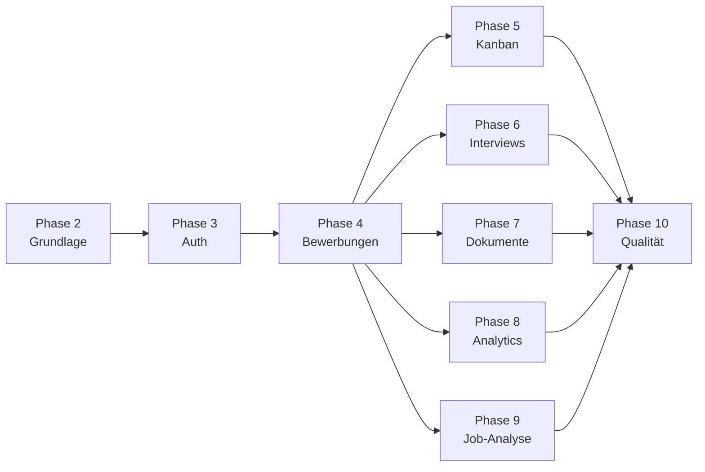

# Jobbed – Umsetzungsplan

> Status: Phase 1 (Planung) · Letzte Aktualisierung: 2026-07-18

Der Plan ist inkrementell: Nach jeder Phase ist das Projekt kompilierbar,
getestet und – wo sinnvoll – per `docker compose up --build` lauffähig. Jede
Phase nennt Ziel, Umfang und **Akzeptanzkriterien (AK)**.

## Phase 1 – Planung ✅ (dieser Schritt)

**Ziel:** Fundierte Entwurfsdokumente.
**Umfang:** `docs/architecture.md`, `docs/data-model.md`, `docs/api-design.md`,
`docs/security.md`, `docs/implementation-plan.md`, `docs/risks.md`.

**AK:**
- [x] Architektur mit Mermaid-Systemdiagramm.
- [x] Datenmodell mit ER-Diagramm und Status-Workflow.
- [x] API-Entwurf mit Endpunkten, DTOs, Pagination, Filtern, Fehlerformat.
- [x] Sicherheitskonzept mit Auth-Ablauf, Token-Lebenszyklus, Autorisierung,
      Angriffsschutz.
- [x] Umsetzungsplan mit Akzeptanzkriterien.
- [x] Risikoliste mit Gegenmaßnahmen.

## Phase 2 – Projektgrundlage

**Ziel:** Lauffähiges Skelett von Frontend, Backend, DB, Docker.
**Umfang:** Monorepo-Struktur; Spring-Boot-Projekt (Maven, Java 21, Profile
`dev/test/prod`); Angular-Standalone-Projekt (ESLint/Prettier, Material-Theme);
PostgreSQL + Flyway-Baseline; zentrale Fehlerbehandlung + Fehlerformat; OpenAPI/
Swagger; strukturiertes Logging + Correlation-ID-Filter; `docker-compose.yml`
(frontend, backend, postgres, mailpit); `.env.example`; README-Grundgerüst.

**AK:**
- [ ] `docker compose up --build` startet Postgres, Backend, Frontend, Mailpit.
- [ ] Backend liefert `GET /actuator/health` = `UP`.
- [ ] Swagger UI unter `/swagger-ui.html` erreichbar.
- [ ] Frontend zeigt Landing Page und baut ohne Lint-Fehler.
- [ ] Ein absichtlich fehlerhafter Request liefert das definierte Fehler-JSON.
- [ ] Flyway führt Baseline-Migration aus; `ddl-auto=validate`.

## Phase 3 – Authentifizierung

**Ziel:** Vollständiger Auth-Flow inkl. Frontend.
**Umfang:** User/UserProfile-Entities + Migrationen; Registrierung, Login,
Refresh (Rotation + Reuse-Detection), Logout, `/auth/me`; E-Mail-Verifikation,
Forgot/Reset; BCrypt, Passwort-Policy; Rate-Limiting; JWT-Provider + Security-
Filterchain; CORS/Header/Cookies; Frontend: Auth-Seiten, `AuthStore`, Guards,
HTTP-Interceptors (Token-Anhang, Silent-Refresh single-flight, Error-Mapping).

**AK:**
- [ ] Registrierung → Verifikations-Mail landet in Mailpit.
- [ ] Login setzt HttpOnly-Refresh-Cookie und liefert Access-Token.
- [ ] Abgelaufenes Access-Token wird automatisch (einmalig, kein Sturm) erneuert.
- [ ] Logout widerruft Refresh-Token; Folgerequests → 401.
- [ ] Wiederverwendung eines widerrufenen Refresh-Tokens widerruft alle Sessions.
- [ ] Guards leiten Unauthentifizierte zur Login-Seite.
- [ ] Tests: Auth-, Refresh-, Security-, Rate-Limit-Tests grün.

## Phase 4 – Bewerbungsverwaltung

**Ziel:** Kern-CRUD mit Mandantentrennung.
**Umfang:** Company, ContactPerson, JobApplication, ApplicationActivity, Tag +
Migrationen/Indizes; Services, MapStruct-Mapper, DTOs; Listen-API mit Paging/
Sort/Filter/Volltextsuche; Aktivitäten-Endpunkte; Frontend:
Bewerbungsübersicht, Detailseite, Create/Edit-Formulare (Reactive Forms,
Autocomplete, Tags, Datepicker, Unsaved-Changes-Guard), Company-/Contact-Seiten,
`ApplicationStore`/`CompanyStore`.

**AK:**
- [ ] Nutzer sieht/ändert nur eigene Bewerbungen (Ownership-Tests grün).
- [ ] Liste unterstützt Paging, Sortierung, Status-/Firmen-/Prioritäts-/Tag-Filter, Suche.
- [ ] Statuswechsel erzeugt `APPLICATION_ACTIVITY`.
- [ ] Firma mit Bewerbungen löschen → `409`.
- [ ] Formulare zeigen Feld- und Serverfehler; warnen bei ungespeicherten Änderungen.
- [ ] Keine N+1-Queries in Listen (verifiziert).

## Phase 5 – Kanban-Board

**Ziel:** Drag-and-Drop-Board mit optimistischem Update.
**Umfang:** CDK-Drag-and-Drop; Spalten = Status; Karten mit Kerninfos;
Statusupdate via `PATCH /status`; optimistisches UI-Update + Rollback bei
Fehler; Bestätigungsdialog für `REJECTED`/`WITHDRAWN`; Board-Filter;
Tastatur-/Screenreader-Zugänglichkeit.

**AK:**
- [ ] Karte per Maus **und** Tastatur verschiebbar.
- [ ] Statuswechsel wird persistiert; API-Fehler → visueller Rollback + Toast.
- [ ] Bestätigungsdialog vor `REJECTED`/`WITHDRAWN`.
- [ ] Jede Verschiebung erzeugt eine Aktivität.
- [ ] Board-Filter (Firma, Tag, Priorität, Suche) funktionieren.

## Phase 6 – Interviews & Erinnerungen ✅

**Ziel:** Terminplanung + Benachrichtigungen.
**Umfang:** Interview-/Reminder-Entities + Endpunkte; Kalenderansicht;
Scheduler (idempotent, kein Doppelversand nach Neustart via `sent`-Flag +
Sperre); E-Mail-Benachrichtigungen (Mailpit); In-App-Benachrichtigungen;
Deadline-Warnungen.

**AK:**
- [x] Interview anlegen/bearbeiten/löschen; Kalender zeigt Zeitfenster.
- [x] Reminder wird zum Zeitpunkt genau einmal versendet (`sent=true`).
- [x] Neustart des Backends verursacht keinen Doppelversand.
- [x] Interview-Reminder respektiert `reminderMinutesBefore`.
- [x] Scheduler-/Benachrichtigungstests grün.

## Phase 7 – Dokumente ✅

**Ziel:** Sicherer Upload/Download.
**Umfang:** `FileStorageService` + `LocalFileStorageService`; Upload mit
Validierung (MIME, Magic-Bytes, Größe, Sanitizing); autorisierter Download;
Dokumentliste je Bewerbung; Frontend-Upload-UI.

**AK:**
- [x] Nur erlaubte Typen/Größen werden akzeptiert (`415`/`413` sonst).
- [x] Download nur für Besitzer; fremder Zugriff → `404`.
- [x] Datei wird über Backend gestreamt, nicht öffentlich ausgeliefert.
- [x] Upload-/Download-/Security-Tests grün.

## Phase 8 – Analytics & Dashboard

**Ziel:** Kennzahlen und Visualisierung.
**Umfang:** Analytics-Endpunkte (Overview, Statusverteilung, Zeitreihe,
Quoten, Quellen-/Firmen-Performance); read-optimierte Queries; Dashboard mit
Karten/Widgets; Charts (ng2-charts). Berechnungsdefinitionen dokumentiert.

**AK:**
- [ ] Dashboard zeigt alle geforderten Kennzahlen.
- [ ] Quoten stimmen mit dokumentierten Formeln überein (Unit-Tests).
- [ ] Zeitreihe nach Woche/Monat filterbar.
- [ ] Charts hell/dunkel korrekt dargestellt.

## Phase 9 – Stellenanzeigen-Analyse ✅

**Ziel:** Regelbasierte Skill-Erkennung + Profil-Match.
**Umfang:** `JobDescriptionAnalyzer`-Interface + `RuleBasedJobDescriptionAnalyzer`
(Skill-Wörterbücher, Seniorität, Benefits, Arbeitsmodell, Gehalt); Match gegen
Profil (erkannt/übereinstimmend/fehlend, Prozent, Vorschläge); optionaler
KI-Adapter vorbereitet (deaktiviert ohne Konfiguration); Frontend-Ergebnisseite.

**AK:**
- [x] Einfügen einer Beschreibung liefert erkannte Skills, Match-% und Vorschläge.
- [x] KI-Adapter nur bei gesetzter Konfiguration aktiv.
- [x] Analyzer-Tests decken typische Beschreibungen ab.

## Phase 10 – Qualität, Betrieb & Doku 🚧

**Ziel:** Produktionsnahe Reife.
**Umfang:** Testabdeckung ergänzen (Unit/Integration/Testcontainers/E2E-Szenarien
1–10); Accessibility-Prüfung; Performance (Indizes, N+1, Bundle-Size); CI/CD
(PR-Pipeline: Backend build+test, Frontend lint+test+build, Docker-Build; Merge:
Images pushen); Monitoring/Actuator finalisieren; README mit allen Abschnitten +
Mermaid-Diagrammen; Seed-Daten + Demo-Login.

**AK:**
- [x] Alle 10 E2E-Szenarien laufen grün (inkl. „fremde Daten nicht öffnen").
- [ ] CI-Pipeline bei PR vollständig grün; Caching für Maven/npm aktiv.
- [x] Testcontainers-Integrationstests laufen lokal und sind in CI eingebunden.
- [x] README vollständig inkl. Diagrammen, Setup, Testbefehlen, Sicherheitskonzept.
- [x] Seed-Daten + dokumentierter Demo-Login vorhanden.

## Querschnitt (in jeder Phase)

- Tests parallel zur Implementierung; keine Platzhalter in Kernfunktionen.
- Nach jedem größeren Schritt: Build + relevante Tests + Linter ausführen,
  gefundene Fehler direkt beheben.
- Phasenabschluss dokumentiert: implementierte Funktionen, geänderte Dateien,
  ausgeführte Befehle, Testergebnisse, offene Punkte.

## Abhängigkeiten (Kurzüberblick)

