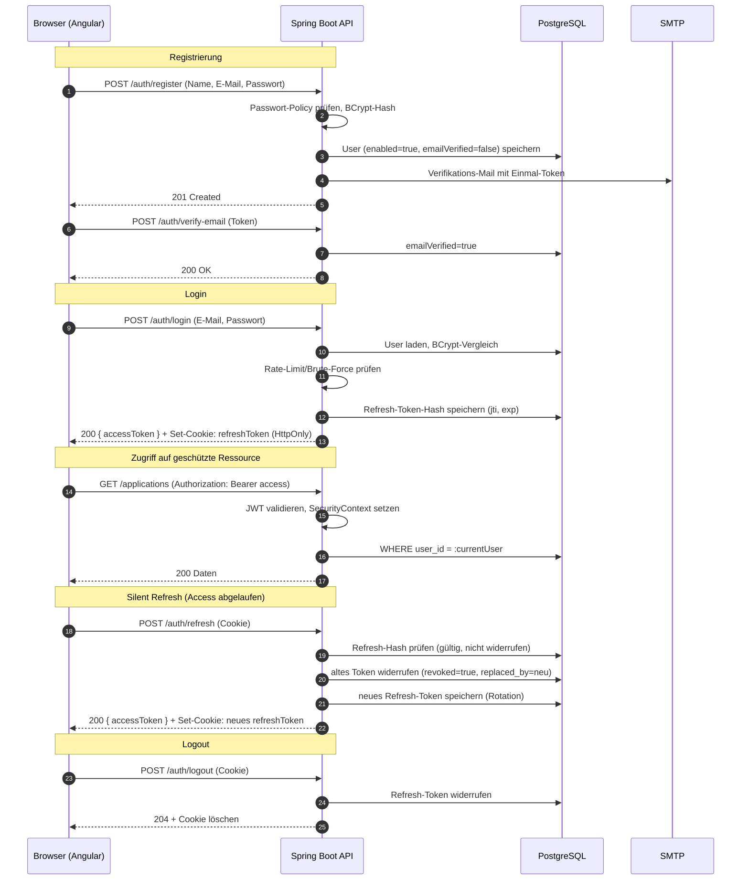
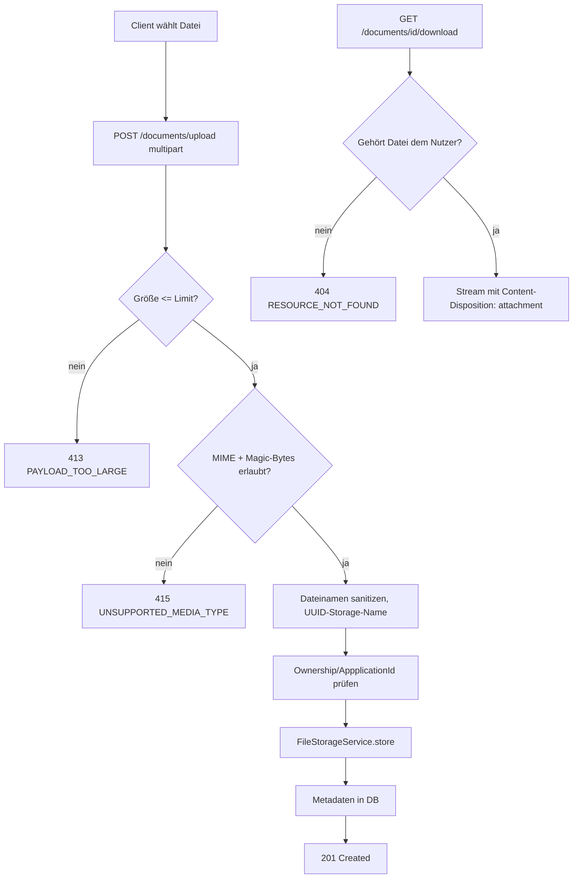

# Jobbed – Sicherheitskonzept

> Status: Phase 1 (Planung) · Letzte Aktualisierung: 2026-07-18

## 1. Ziele

- **Vertraulichkeit & Mandantentrennung:** Ein Nutzer kann ausschließlich eigene
  Daten lesen/ändern/löschen.
- **Sichere Authentifizierung:** kurzlebige Access-Tokens, rotierende
  Refresh-Tokens in HTTP-only-Cookies, kein Token im `localStorage`.
- **Defense in Depth:** Validierung, Autorisierung, Rate-Limiting, sichere
  Header und CORS auf jeder Ebene.

## 2. Token-Modell

| Token | Speicherort | Lebensdauer | Inhalt |
|-------|-------------|-------------|--------|
| **Access-Token (JWT)** | Frontend-Speicher (Signal, RAM) | ~15 min | `sub`=userId, `email`, `role`, `iat`, `exp`, `jti` |
| **Refresh-Token** | HTTP-only, Secure, SameSite=Strict Cookie | ~7 Tage | Opaker Zufallswert; nur **Hash** in DB (`refresh_token`) |

- Access-Token signiert mit **RS256** (asymmetrisch) oder mindestens HS256 mit
  starkem Secret aus der Umgebung. Bevorzugt RS256, damit Ressourcen-Server nur
  den Public Key benötigen.
- Refresh-Token wird **nie** im JWT-Format ausgegeben; er ist ein opakes,
  kryptographisch zufälliges Geheimnis; in der DB liegt nur der SHA-256-Hash.
- Access-Token bewusst nicht persistiert → Logout wirkt über Refresh-Widerruf +
  kurze Access-Lebensdauer.

## 3. Authentifizierungsablauf

## 4. Refresh-Token-Rotation & Wiederverwendungserkennung

- Bei jedem `/auth/refresh` wird das alte Token widerrufen und ein neues
  ausgegeben (Rotation). `replaced_by` verkettet die Kette.
- **Reuse-Detection:** Wird ein bereits widerrufenes Refresh-Token erneut
  vorgelegt, gilt dies als möglicher Diebstahl → **alle** Refresh-Tokens des
  Nutzers werden widerrufen und ein Sicherheitshinweis geloggt.
- Abgelaufene/widerrufene Tokens werden periodisch per Scheduler bereinigt.

## 5. Passwörter

- Hashing mit **BCrypt** (Cost ≥ 12); Argon2 als Alternative konfigurierbar.
- **Policy:** min. 10 Zeichen, Groß-/Kleinbuchstabe, Ziffer, Sonderzeichen;
  Abgleich gegen kurze Liste kompromittierter Passwörter. Prüfung server- **und**
  clientseitig.
- Passwortänderung erfordert aktuelles Passwort und widerruft alle
  Refresh-Tokens (Re-Login).
- **Forgot/Reset:** `forgot-password` antwortet **immer** `200` (keine
  Existenz-Enumeration); Reset-Token einmalig, kurzlebig (~30 min), nur Hash in
  DB; erfolgreicher Reset widerruft alle Sessions.

## 6. Autorisierung

- **Rollen:** `USER`, `ADMIN` (`ROLE_`-Präfix in Spring Security).
- **Method-Security:** `@PreAuthorize` auf Service-/Controller-Ebene für
  Admin-Endpunkte.
- **Besitzprüfung (Ownership):** Jeder Zugriff auf fachliche Ressourcen filtert/
  prüft `user_id == currentUserId`. Die `userId` stammt **ausschließlich** aus
  dem `SecurityContext`, niemals aus Request-Body oder -Parametern.
- **Umsetzungsmuster:** Repository-Methoden erwarten `userId` als Pflichtargument
  (`findByIdAndUserId`), sodass fremde Ressourcen als `404` erscheinen.
- **Admin-Grenze:** Admin darf Nutzer verwalten (Liste, aktivieren/deaktivieren),
  aber keine privaten Bewerbungsinhalte anderer Nutzer lesen.

Autorisierungsregeln (Auszug):

| Ressource | USER | ADMIN |
|-----------|------|-------|
| Eigene Bewerbungen/Firmen/Kontakte/… | CRUD | – |
| Fremde fachliche Daten | ❌ (404) | ❌ (404) |
| `/admin/users` | ❌ (403) | ✅ |
| `/admin/users/{id}/status` | ❌ | ✅ |
| `/actuator/metrics`, `/admin/system` | ❌ | ✅ |

## 7. Rate-Limiting & Brute-Force-Schutz

- **Login/Refresh/Forgot-Password:** IP- und accountbasiertes Rate-Limiting
  (z. B. Bucket4j oder eigener Filter). Nach N Fehlversuchen temporäre Sperre mit
  exponentiellem Backoff.
- Antwortzeiten für „User existiert nicht" vs. „falsches Passwort" werden
  angeglichen (Timing-Angriffe vermeiden).
- `429 RATE_LIMIT_EXCEEDED` mit `Retry-After`-Header.

## 8. Transport, CORS & HTTP-Header

- **HTTPS** erzwungen in `prod` (HSTS).
- **CORS:** Whitelist der Frontend-Origin(s) aus Konfiguration; `allowCredentials=true`
  nur für erlaubte Origins; keine Wildcard mit Credentials.
- **Security-Header** (via Spring Security / nginx): `X-Content-Type-Options: nosniff`,
  `X-Frame-Options: DENY`, `Referrer-Policy: no-referrer`, restriktive
  `Content-Security-Policy`, `Permissions-Policy`, HSTS.
- **Cookies:** `HttpOnly`, `Secure`, `SameSite=Strict`, `Path=/api/v1/auth`.

## 9. CSRF

- API ist überwiegend zustandslos (Bearer-Token) → CSRF für Bearer-Endpunkte
  nicht relevant.
- Die **cookie-gestützten** Endpunkte (`/auth/refresh`, `/auth/logout`) sind
  durch `SameSite=Strict` geschützt; zusätzlich enger Cookie-`Path`. Optional
  Double-Submit-Token, falls SameSite-Kompatibilität nicht ausreicht.

## 10. Eingabevalidierung & Injection-Schutz

- **Bean Validation** (`@Valid`, `@NotBlank`, `@Size`, `@Email`, …) auf allen
  Request-DTOs; zentrale Fehlerabbildung.
- **SQL-Injection:** ausschließlich JPA/Parameter-Bindung, kein String-Konkatenat.
- **XSS:** Angular escaped standardmäßig; kein `innerHTML` mit ungeprüften Daten;
  Markdown-Rendering (Notizen) nur mit Sanitizer.
- **Mass Assignment:** getrennte DTOs verhindern das Setzen serverkontrollierter
  Felder (`id`, `userId`, `role`, Timestamps).

## 11. Datei-Upload-Sicherheit

- Whitelist erlaubter MIME-Typen + Magic-Byte-Prüfung; Größenlimit; Original-
  Dateiname wird gespeichert, aber nie als Pfad genutzt (generierter
  Storage-Name).
- Download nur über autorisierten Endpunkt; `Content-Disposition: attachment` und
  `X-Content-Type-Options: nosniff` verhindern Inline-Ausführung.
- Keine Auslieferung über öffentliche statische Verzeichnisse.

## 12. Logging & Datenschutz

- Strukturierte Logs mit Correlation-ID; **keine** Passwörter, Token, Hashes
  oder vollständigen PII im Log.
- Fehlerdetails/Stacktraces nur serverseitig; Client erhält generische Meldung +
  `correlationId`.
- Verifikations-/Reset-Token werden nicht geloggt.

## 13. Abgleich mit OWASP Top 10

| Risiko | Maßnahme |
|--------|----------|
| A01 Broken Access Control | Ownership-Filter, Method-Security, 404 statt 403, keine Client-`userId` |
| A02 Cryptographic Failures | BCrypt/Argon2, RS256, HTTPS/HSTS, gehashte Refresh/Reset-Token |
| A03 Injection | JPA-Bindung, Bean Validation, Angular-Escaping, Sanitizer |
| A04 Insecure Design | Threat-orientierte Token-Rotation, getrennte DTOs, Rate-Limits |
| A05 Security Misconfiguration | sichere Defaults, `ddl-auto=validate`, gehärtete Header, keine Secrets im Repo |
| A06 Vulnerable Components | Dependency-Scanning in CI, regelmäßige Updates |
| A07 Auth Failures | Rate-Limit, Brute-Force-Schutz, sichere Sessions, E-Mail-Verifikation |
| A08 Integrity Failures | signierte Tokens, verifizierte Migrationen, gepinnte Base-Images |
| A09 Logging Failures | Correlation-ID, sichere Logs, Security-Events geloggt |
| A10 SSRF | keine ungeprüften Server-seitigen URL-Fetches; Job-URL wird nur gespeichert |

## 14. Secrets & Konfiguration

- Keine echten Secrets im Repository; `.env.example` dokumentiert Variablen
  (JWT-Keys, DB-Credentials, SMTP, Cookie-Domain).
- Getrennte Profile `dev`/`test`/`prod` mit sicheren Defaults; Produktions-
  Secrets über Umgebungsvariablen/Secret-Store.

## 15. KI-Datenschutz und Prompt-Sicherheit

- `AI_API_KEY` existiert ausschließlich im Backend und wird weder über Status-
  Endpunkte noch über Logs an den Browser gegeben.
- KI ist standardmäßig deaktiviert. Erst `AI_PROVIDER=openai` plus ein gesetzter
  Schlüssel aktivieren die externe Übertragung von Stellen- oder Lebenslaufdaten.
- System-Prompts behandeln Stellenanzeigen und Nutzereingaben als nicht
  vertrauenswürdige Daten und weisen eingebettete Anweisungen ausdrücklich zurück.
- Antworten werden als JSON validiert und auf serverseitig definierte DTOs sowie
  Mengen- und Längenlimits reduziert; Angular escaped die Ausgabe zusätzlich.
- Bei Ausfällen werden keine Rohantworten ausgegeben: Analyse und Lebenslauf
  wechseln kontrolliert in einen lokalen Fallback-Modus.
